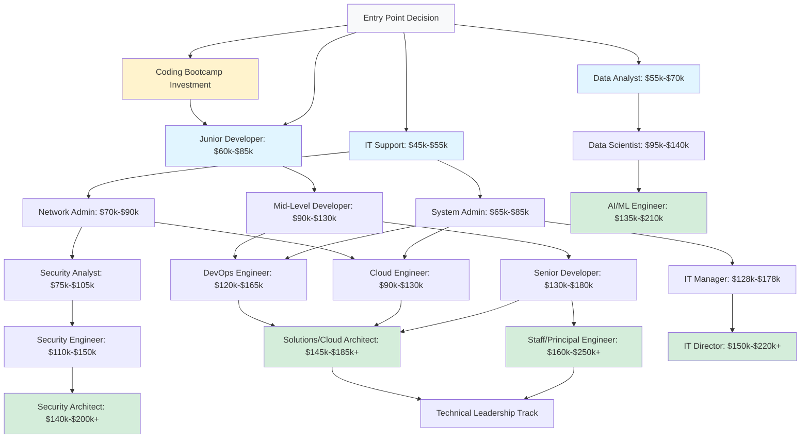

# Getting Started in IT: A Decision Framework for Newcomers
# Getting Started in IT: A Decision Framework for Newcomers

## Table of Contents

- [Should You Even Enter IT?](#should-you-even-enter-it)
- [Choosing Your First Role](#choosing-your-first-role)
- [Minimum Viable Skills by Role](#minimum-viable-skills-by-role-entry-level)
- [Action Plan](#action-plan-your-first-90-days)
- [Free and Low-Cost Resources](#free-and-low-cost-resources)
- [Career Progression Flowchart](#career-progression-flowchart)
- [Interview Preparation Guide](#interview-preparation-guide)
  - [Interview Types](#interview-types)
  - [Role-Specific Preparation](#role-specific-preparation)
  - [Behavioral Interview Mastery](#behavioral-interview-mastery-star-method)
  - [Salary Negotiation](#salary-negotiation)
- [Reality Check](#reality-check-brutal-honesty)
- [Key Takeaways](#key-takeaways)

---

So you're considering a career in Information Technology. This guide helps you determine if IT is right for you and provides concrete first steps.

## Should I Enter IT? Key Questions

### Question 1: Do I enjoy problem-solving and continuous learning?
**Why it matters:** Technology changes rapidly. You'll need to learn new tools, languages, and methodologies every 2-3 years throughout your career.

**Green flags:**
- You enjoy figuring out how things work
- You don't mind reading documentation
- You're comfortable with ambiguity and trial-and-error

**Red flags:**
- You want a career that stays the same year after year
- You hate feeling like a beginner
- You need step-by-step instructions for everything

### Question 2: Can I handle 2-4 years of learning before peak earnings?
**Reality check:** Entry-level IT roles ($45k-$80k) require 6-24 months of preparation. Mid-career roles ($80k-$150k+) typically require 3-5 years of experience.

**Timeline expectations:**
- **Year 0-1:** Learning fundamentals, certifications, portfolio building
- **Year 1-2:** First IT job (help desk, junior developer, analyst)
- **Year 3-5:** Skill specialization, job changes for salary growth
- **Year 5+:** Senior/specialist roles with $100k+ potential

⬆️ **[Back to Table of Contents](#table-of-contents)**

---

### Question 3: Which path fits my personality?

**Hands-on Technical (for detail-oriented, systematic thinkers):**
- DevOps Engineer, Database Admin, System Administrator
- You'll configure systems, troubleshoot issues, automate processes
- Less interaction with non-technical people

**Strategic/Communication-Focused (for big-picture thinkers):**
- IT Manager, Cloud Architect, Prompt Engineer (Note: This role is evolving - newer LLM models are easier to use, so standalone demand may decrease. However, the skill of effective AI prompting is integrating into many other technical roles)
- You'll design systems, communicate with stakeholders, make trade-off decisions
- More meetings, documentation, presentations

**Creative Technical (for visual/design-oriented problem-solvers):**
- UI/UX Engineer, Graphic Designer
- You'll create interfaces, optimize user experience
- Balance of aesthetics and functionality

### Question 4: Am I prepared for modern IT career patterns?
IT is no longer "get a job and stay 30 years." Modern IT careers involve:
- Changing jobs every 2-4 years for salary growth
- Self-managing retirement (401k, not pensions)
- Continuous skill updates to stay relevant
- **See [Career_Trends.md](Career_Trends.md) for details**

---

## Minimum Viable Skills to Start

You don't need a 4-year CS degree to start in IT. Here's what you need for common entry points:

### IT Support / Help Desk (Entry Level)
**Time to job-ready:** 3-6 months  
**Starting salary:** $45k-$55k

**Must-have skills:**
- CompTIA A+ certification (or equivalent knowledge)
- Basic Windows and Mac troubleshooting
- Customer service skills
- Ticketing system familiarity

**Free learning path:**
1. Professor Messer's A+ course (YouTube - free)
2. Practice building/troubleshooting PCs
3. Set up home lab (old laptop with VirtualBox)

⬆️ **[Back to Table of Contents](#table-of-contents)**

---

### Junior Developer / Platform Developer
**Time to job-ready:** 6-12 months  
**Starting salary:** $60k-$85k

**Must-have skills:**
- One programming language (Python or JavaScript recommended)
- Git version control
- Basic web development (HTML/CSS/JS)
- Portfolio with 2-3 projects

**Free learning path:**
1. freeCodeCamp or The Odin Project (completely free, project-based)
2. Build 3 projects: personal website, to-do app, API integration
3. GitHub account with documented code

### Data Analyst
**Time to job-ready:** 4-8 months  
**Starting salary:** $55k-$70k

**Must-have skills:**
- SQL (critical - this is 70% of the job)
- Understanding of two primary OS (Windows and Linux basics)
- Basic networking concepts and how applications communicate
- Excel (pivot tables, VLOOKUP) for data manipulation
- One visualization tool (Tableau Public or Power BI)
- Basic statistics (mean, median, distributions, correlation)

**Free learning path:**
1. Khan Academy Statistics
2. SQLZoo or Mode Analytics SQL tutorial (free)
3. Tableau Public or Power BI for visualization practice
4. **Salesforce Trailheads** (free interactive learning for Salesforce ecosystem - highly valuable for career growth)
5. Analyze a public dataset (Kaggle) and present findings

---

## How to Choose Your First Role

### Decision Matrix

| If you value... | Consider... | Entry salary | Time to learn |
|:---|:---|:---|:---|
| Quick entry, predictable hours | IT Support → System Admin | $45k-$55k | 3-6 months |
| High earning potential, creativity | Software Developer → Senior Dev | $60k-$85k | 6-12 months |
| Job security, steady demand | Cybersecurity Analyst | $55k-$75k | 8-12 months + Security+ |
| Data-driven work, business impact | Data Analyst → Data Scientist | $55k-$70k | 4-8 months |
| Cutting-edge tech, high growth | AI/ML path (requires degree or bootcamp) | $85k-$110k (post-education) | 12-24 months |

⬆️ **[Back to Table of Contents](#table-of-contents)**

---

### The "Safe Bet" Strategy
Start with **IT Support** → **accumulate certifications** → **specialize** in:
- Cloud (AWS/Azure certs) → Cloud Engineer ($90k+)
- Networking (CCNA) → Network Engineer ($75k+)
- Security (Security+, CISSP) → Security Analyst ($80k+)

This path has lowest barrier to entry and multiple specialization options.

### The "High Risk, High Reward" Strategy
Self-study **Software Development** (6-12 months) or attend **coding bootcamp** ($10k-$20k) → Junior Developer → job-hop aggressively for salary growth.

**Pros:** Highest earning potential ($150k+ by year 5-7)  
**Cons:** Competitive entry, requires portfolio, more difficult self-study path

---

## First Steps (Action Plan)

### Month 1: Research & Foundation
- [ ] Read through all 15 role profiles in this repository
- [ ] Watch "Day in the Life" YouTube videos for 3 roles that interest you
- [ ] Join /r/ITCareerQuestions and read pinned threads
- [ ] Set up LinkedIn profile with "Aspiring [Role]" headline

### Months 2-3: Learn Core Skills
- [ ] Choose ONE learning path (pick from Minimum Viable Skills above)
- [ ] Complete first certification or course (don't switch mid-stream!)
- [ ] Build first project or lab environment
- [ ] Document learning in blog or GitHub

### Months 4-6: Build Portfolio
- [ ] Complete 2-3 projects demonstrating skills
- [ ] Earn first certification (CompTIA A+, Security+, or equivalent)
- [ ] Update LinkedIn with skills and portfolio link
- [ ] Start applying to entry-level roles (even if you feel "not ready")

⬆️ **[Back to Table of Contents](#table-of-contents)**

---

### Month 6+: Job Search
- [ ] Apply to 10-15 jobs per week
- [ ] Network on LinkedIn (connect with IT professionals, engage with content)
- [ ] Prepare for technical interviews (mock interviews on Pramp)
- [ ] Be willing to accept slightly lower salary for first role to gain experience

---

## Free and Low-Cost Resources

### Certifications (Most Cost-Effective)
- **CompTIA A+** (~$250 exam fee): Best for IT Support entry
- **Google IT Support Certificate** (Coursera, ~$50/month): Alternative to A+
- **AWS Certified Cloud Practitioner** (~$100): Great for cloud path
- **CompTIA Security+** (~$400): Gold standard for cybersecurity entry

### Learning Platforms (Free Tier)
- **freeCodeCamp** (100% free): Web development, Python, data analysis
- **The Odin Project** (100% free): Full-stack web development
- **edX / Coursera**: Audit courses free (certificates cost money)
- **YouTube**: Professor Messer (CompTIA certs), NetworkChuck (networking/cloud), Traversy Media (coding)

### Hands-On Practice (Free)
- **TryHackMe / HackTheBox**: Cybersecurity labs (free tier)
- **AWS Free Tier**: 12 months free cloud practice
- **VirtualBox** / **VMware Player**: Free virtualization for home labs

---

## Reality Checks

### What They Don't Tell You
1. **Imposter syndrome is real.** Everyone feels underqualified. Apply anyway.
2. **Your first job will probably suck.** Help desks are repetitive, entry dev roles can be boring. It's a stepping stone.
3. **Certifications don't guarantee jobs.** They get you interviews. Projects and communication skills get you hired.
4. **Degree not required, but helps.** You can succeed without a CS degree, but you'll face more initial rejections.
5. **Burnout is common.** See [Career_Trends.md](Career_Trends.md) - strategic job changes every 2-4 years are normal and healthy.

⬆️ **[Back to Table of Contents](#table-of-contents)**

---

### Biggest Mistakes Newcomers Make
❌ **Trying to learn everything at once** - pick ONE path and go deep  
❌ **Waiting until "ready"** - Start applying at 70% ready  
❌ **Ignoring soft skills** - communication and **technical writing** are differentiators  
❌ **Not networking** - 50%+ of jobs come from referrals  
❌ **Giving up after rejections** - 50-100 applications is normal  

---

## Key Takeaway

**You can start an IT career in 3-12 months** with focused learning, even with no prior experience. The key is:
1. **Pick one clear path** (don't dabble in 5 different areas)
2. Learn the **minimum viable skills**
3. Build a **small portfolio** (2-3 projects >> 100% course completion)
4. **Apply aggressively** (treat job search as a numbers game)
5. Understand modern IT career patterns - see **[Career_Trends.md](Career_Trends.md)**

**Your first IT job is not your career - it's your entry point.** Strategic job changes every 2-4 years will drive your growth from $50k → $100k+ in 5-7 years.

Ready to dive deeper? Review the 15 role profiles and pick your path: [IT Career Navigator](README.md)

---

## IT Career Progression Flowchart

Below is a visual representation of common career paths in IT, showing how you can progress from entry-level to senior roles:

**Key Insights from the Flowchart:**
- **Multiple entry points:** Help Desk (easiest), Developer (highest potential), Data Analyst (balanced)
- **Career velocity:** Entry → Mid takes 2-4 years, Mid → Senior takes 3-5 years
- **Convergence paths:** Many roles (DevOps, Cloud, Senior Dev) lead to Architect positions
- **Management split:** Around mid-career, choose technical track vs. management track
- **Salary progression:** Most paths can reach $150k+ in 7-10 years with strategic job changes

⬆️ **[Back to Table of Contents](#table-of-contents)**

---

## Interview Preparation Guide

Landing your first (or next) IT role requires more than technical skills - you need to prepare for the interview process.

### Types of IT Interviews

**1. Phone/Video Screen (30-45 min)**
- Recruiter validates basics: work authorization, salary expectations, timeline
- Sometimes includes basic technical questions
- **Goal:** Don't disqualify yourself; show enthusiasm and culture fit

**2. Technical Phone/Video Interview (45-60 min)**
- Live coding (LeetCode-style for developer roles)
- System design discussion (for senior roles)
- Scenario-based troubleshooting (for SRE/DevOps/Support roles)
- **Goal:** Demonstrate technical competency and communication skills

**3. On-site / Virtual On-site (3-5 hours)**
- Multiple rounds with different interviewers
- Mix of technical, behavioral, and culture-fit interviews
- Whiteboard coding or pair programming
- **Goal:** Prove you can do the job AND work well with team

**4. Take-home Assignment (2-8 hours)**
- Build a small project or solve a problem
- Submit code for review
- Sometimes followed by presentation/code review session
- **Goal:** Show real-world coding ability and code quality

### Preparation by Role

**For Developer Roles:**

**LeetCode Preparation (unfortunate but necessary):**
- **Easy problems:** Master 20-30 problems (arrays, strings, hashmaps)
- **Medium problems:** Practice 30-50 problems (trees, graphs, dynamic programming basics)
- **Pattern recognition:** Learn common patterns (two pointers, sliding window, BFS/DFS)
- **Time investment:** 1-2 hours/day for 2-3 months

**Recommended resources:**
- **NeetCode 150**: Curated list of most important LeetCode problems
- **AlgoExpert**: Paid ($99/year) but excellent video explanations
- **Pramp**: Free mock interviews with peers

**System Design (for mid-senior roles):**
- Read "Designing Data-Intensive Applications" (Martin Kleppmann)
- Practice: Design Twitter, Design URL shortener, Design rate limiter
- Resources: **System Design Primer** (GitHub - free), Grokking the System Design Interview

**For SRE/DevOps Roles:**

**Scenario-Based Questions:**
- "Server is slow, how do you troubleshoot?"
- "Website is down, walk me through your incident response"
-"How would you design a monitoring system for microservices?"

**Preparation:**
- Practice explaining technical concepts clearly
- Have stories ready using STAR method (see below)
- Know your tools: "I'd check CPU with `top`, memory with `free -m`, disk I/O with `iotop`..."

**Hands-on Labs:**
- Set up Kubernetes cluster locally (Minikube)
- Deploy app with CI/CD pipeline (GitHub Actions)
- Configure monitoring (Prometheus + Grafana)

**For Data Analyst/Engineer Roles:**

**SQL Mastery:**
- Window functions (RANK, ROW_NUMBER, LAG/LEAD)
- CTEs (Common Table Expressions)
- Complex JOINs and subqueries
- Practice on: LeetCode SQL problems, HackerRank SQL track

**Case Study Preparation:**
- "Given this dataset, how would you measure user engagement?"
- "Design a dashboard for e-commerce metrics"
- Be ready to explain your analytical thinking process

**Take-home project tips:**
- Document your assumptions
- Clean, commented code
- Include README with setup instructions
- Visualizations matter - make it look good

⬆️ **[Back to Table of Contents](#table-of-contents)**

---

### Behavioral Interview Mastery (STAR Method)

Most IT interviews include behavioral questions. Use STAR format:

**STAR = Situation, Task, Action, Result**

**Example question:** "Tell me about a time you had to learn a new technology quickly"

**Bad answer:** "I learned React for a project. It was hard but I figured it out."

**Good answer (STAR):**
- **Situation:** "Our team needed to rebuild our dashboard, and stakeholders wanted it in React, which I hadn't used."
- **Task:** "I had 3 weeks to learn React well enough to build a production-quality component."
- **Action:** "I took a weekend React bootcamp, built 3 practice projects, and pair-programmed with our senior developer for code review."
-**Result:** "I shipped the component on time with zero bugs in the first month, and it became the foundation for 5 other dashboards. I'm now our team's React expert."

**Common behavioral questions - have 2-3 stories ready for each:**
- Tell me about a time you failed / made a mistake
- Describe a conflict with a team member and how you resolved it
- Tell me about a time you had to learn something new quickly
- Describe a project you're most proud of
- How do you prioritize when you have multiple deadlines?

⬆️ **[Back to Table of Contents](#table-of-contents)**

---

### Salary Negotiation

**NEVER give your current salary first**

**Recruiter:** "What's your current compensation?"  
**You:** "I'm currently targeting $X - $Y for this role based on market research and my experience. What's the budget for this position?"

**Research your number:**
- levels.fyi (most accurate for tech)
- Glassdoor (add 10-15% to their numbers, often outdated)
- Blind app (anonymous tech worker forum)
- Ask people in similar roles (anonymous surveys work well)

**When you get an offer:**

1. **Thank them and ask for time:** "Thank you! This is exciting. Can I have 2-3 days to review the full package?"
   
2. **Review TOTAL compensation:**
   - Base salary
   - Signing bonus
   - Annual bonus (and is it guaranteed?)
   - Equity (RSUs, stock options - vesting schedule?)
   - Benefits (401k match, health insurance quality, PTO)
   - Remote flexibility, learning budget, home office stipend

3. **Counter-offer (if below market):**
   > "I'm very excited about this role. Based on my research and the market rate for this position, I was expecting closer to $X. Is there flexibility in the base salary or signing bonus?"

4. **Get it in writing:**
   - All verbal promises mean nothing
   - Offer letter should include: salary, bonus structure, equity details, start date, benefits summary

**Negotiation leverage:**
- Multiple offers (best leverage)
- Rare skills for the role
- Relocation / taking risk on startup
- Strong performance in interviews

**Don't negotiate:**
- PTO (usually fixed by policy)
- 401k match (fixed by policy)
- When offer is already at top of band

⬆️ **[Back to Table of Contents](#table-of-contents)**

---

### Mock Interview Practice

**Free resources:**
- **Pramp**: Peer mock interviews for coding
- **interviewing.io**: Anonymous technical interviews with engineers
- **Career cups / Glassdoor**: Read real interview questions from companies

**Paid (worth it if serious):**
- **Interview Kickstart**: $3k-$8k bootcamp for FAANG interviews (only if targeting very high comp)
- **Exponent**: $200/year for PM/TPM interview prep (also useful for technical roles)

### Day-of-Interview Tips

**Technical Interview:**
- Think out loud - interviewers want to hear your thought process
- Ask clarifying questions - shows you don't make assumptions
- Test your code with edge cases
- Admit when you're stuck and ask for hints

**Behavioral Interview:**
- Be authentic - don't memorize robotic answers
- Show growth mindset - even failures should end with "here's what I learned"
- Ask good questions about the role/team (shows genuine interest)

**Questions to ask interviewers:**
- "What does success look like in this role in the first 6 months?"
- "What's the biggest challenge the team is facing right now?"
- "How do you handle technical debt / on-call rotation / code review?"
- "What's your career path been like here?" (to individual interviewer)
- "Why did you join this company?" (reveals culture)

⬆️ **[Back to Table of Contents](#table-of-contents)**

---

### Red Flags to Watch For

**During interviews, watch for:**
- Interviewer seems unhappy or burned out
- Can't articulate what you'd work on ("you'll figure it out")
- Defensive about questions ("why do you need to know that?")
- Unrealistic expectations ("we need someone who knows 15 technologies")
- Disorganized interview process (no one knows what they're testing)

**Trust your gut.** If the interview feels off, the job will likely feel worse.

### Key Takeaways

1. **Interview prep is a skill** - practice makes perfect, treat it like studying for an exam
2. **LeetCode is unavoidable for developer roles** - 2-3 months of daily practice required
3. **STAR method for behavioral** - have 5-6 well-rehearsed stories ready
4. **Never give salary first** - let them anchor, then negotiate up
5. **Multiple offers = leverage** - apply to 10-15 companies, interview with 5-8
6. **Practice out loud** - mock interviews are THE most valuable prep

**Timeline for serious job search:**
- Month 1: Resume/portfolio polish, company research, apply to 20+ roles
- Month 2: LeetCode daily, mock interviews weekly, first-round interviews
- Month 3: On-site interviews, negotiating offers

**Remember:** Getting rejected is normal. 20-30 applications → 5-8 phone screens → 2-3 on-sites → 1-2 offers is a typical funnel. Don't get discouraged!

---

**Last Updated:** December 2024 | **Next Review:** March 2025

⬆️ **[Back to Table of Contents](#table-of-contents)**